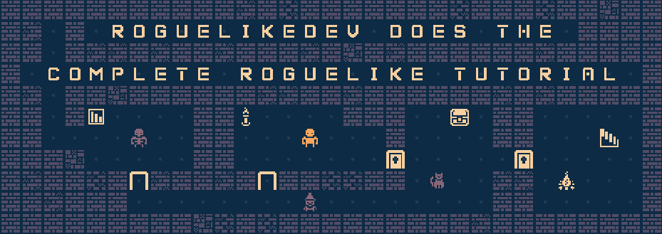
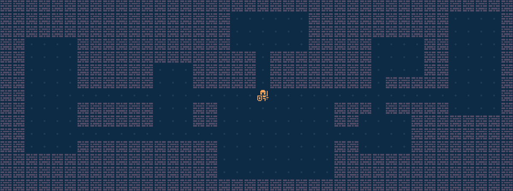
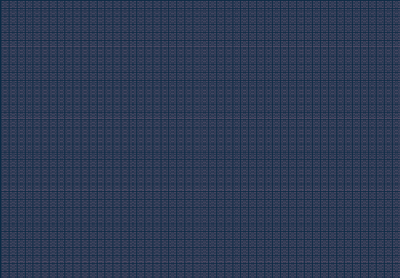
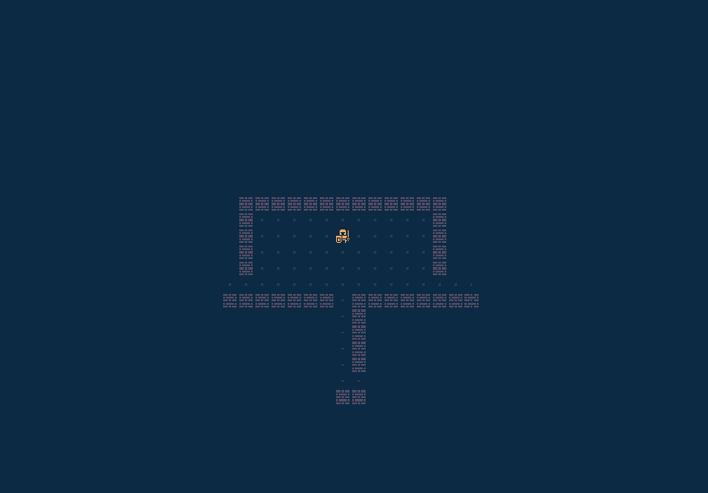

# MiniRogue

A small roguelike written in Godot 4 (alpha build), for the 2022 [RoguelikeDev Does The Complete Roguelike Tutorial](https://www.reddit.com/r/roguelikedev/wiki/python_tutorial_series).

## Chapters

- [x] Part 1

  - [x] Render Map & Entities to screen
  - [x] Basic game loop (Entity performs Action)
  - [x] Entity Collisions with the Map and other Entities

- [x] Part 2

  - [x] Rectangular Rooms and Corner Tunnels
  - [x] Dungeon Generation

- [x] Part 3

  - [x] FOV Calculations based on [this article](http://roguebasin.com/index.php/Eligloscode)
  - [x] FOV Layer on Map
  - [x] Hidden/Dark Wall Tiles
  - [x] Bump Entities

- [ ] Refactors

  - [ ] Change FOV algorithm to [Shadowcasting](http://www.adammil.net/blog/v125_Roguelike_Vision_Algorithms.html#shadowcode)
      - Raycasting does not have expansive walls, generating ugly corridor FOV. 
  - [ ] Change code to make more use of Godot Features (such as Resources)
    - [ ] Level Generator
    - [ ] Monsters
  

## Screenshots

### Room generation

### Proc Gen visualisation

### FOV visualisation

## Resources used

- Godot Engine (v4 alpha 10)
- Roguelike code is based on the [libtcod tutorial](https://rogueliketutorials.com/tutorials/tcod/v2/)
- Color Palette is [SLSO8](https://lospec.com/palette-list/slso8)
- Spritesheet is modified from [Kenney](https://kenney.nl/assets/bit-pack)
